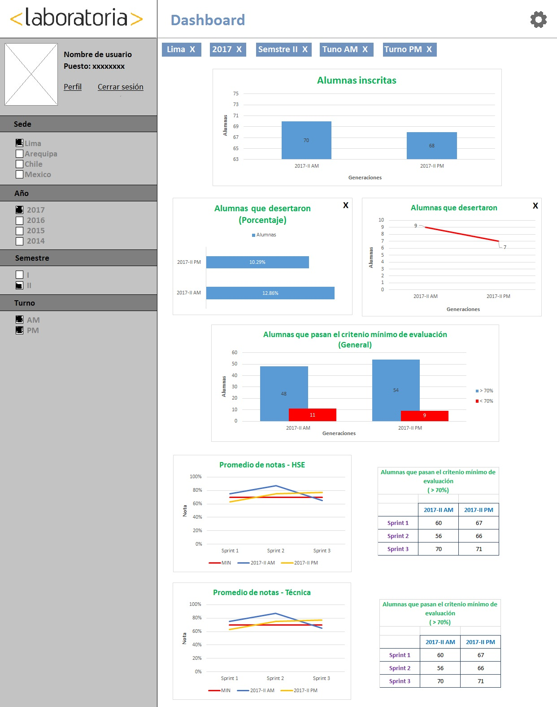

Reto - Dashboard
================

OBJETIVO
--------
Este reto consiste en crear un sketch para la herramienta del dashboard de Laboratoria.

En el dashboard, los usuarios pueden ver rápidamente estadísticas y datos en tiempo real como:

* Cantidad de alumnas inscritas
* Cantidad de alumnas que desertaron
* Cantidad y % de alumnas que pasan el criterio mínimo de evaluación
* Promedio de notas por sprint
* Promedio de notas HSE
* Promedio de notas técnicas

DESARROLLO
----------
